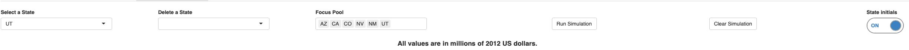
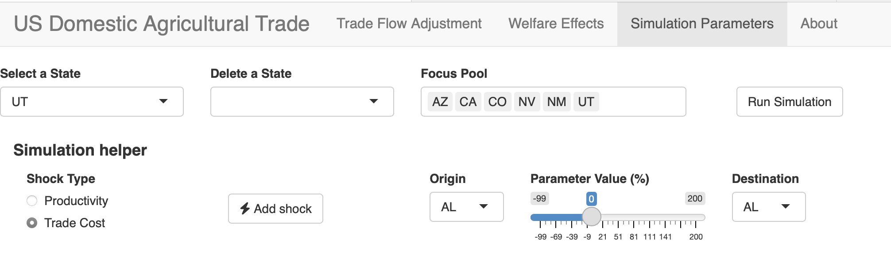
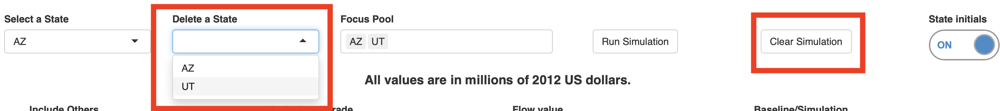
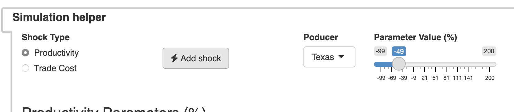
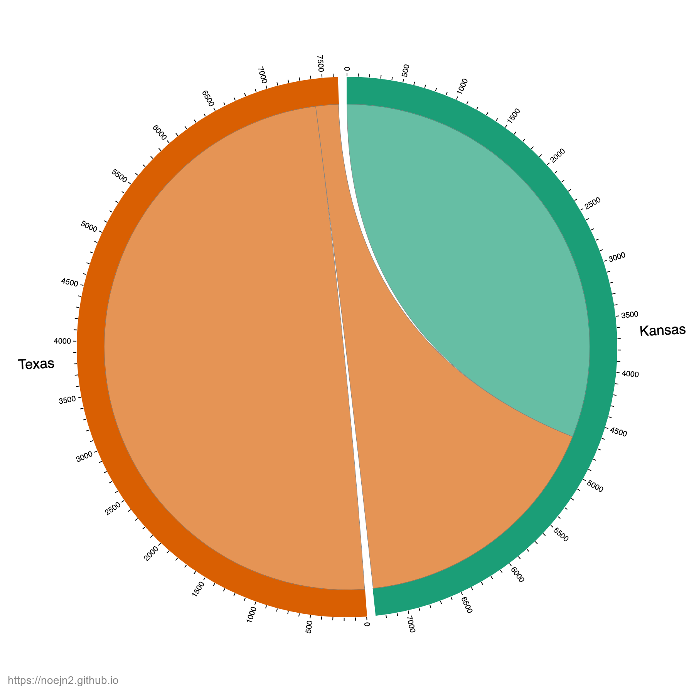
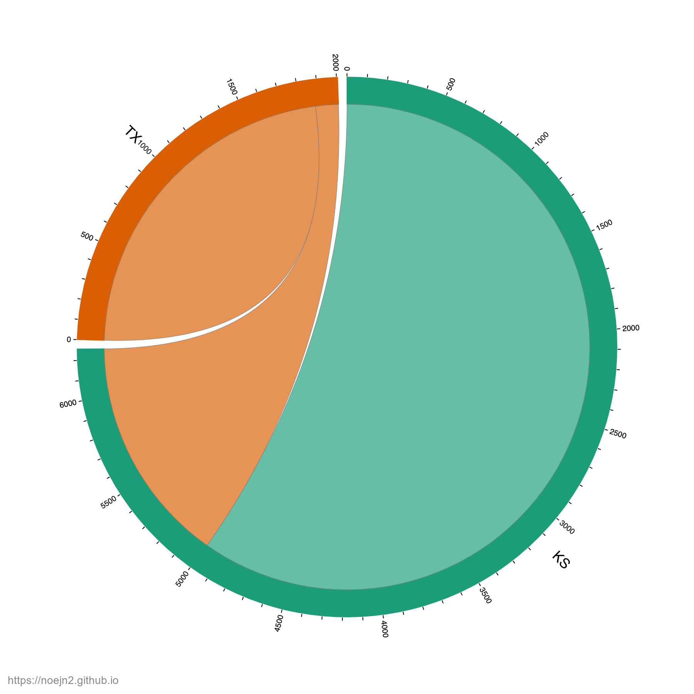
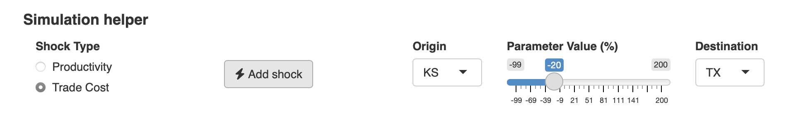
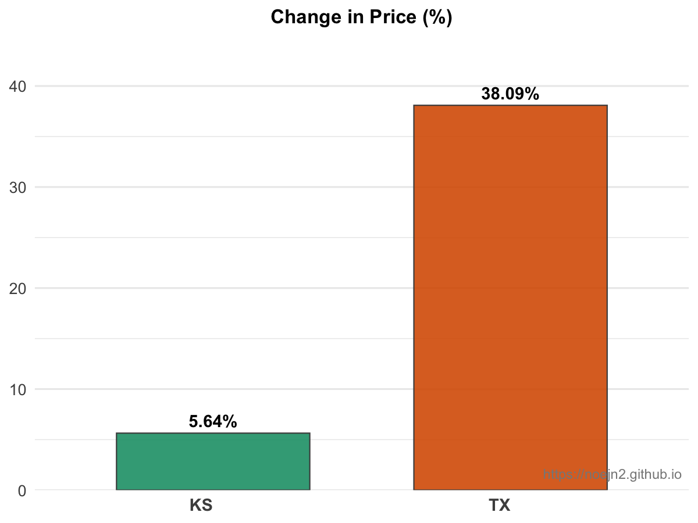
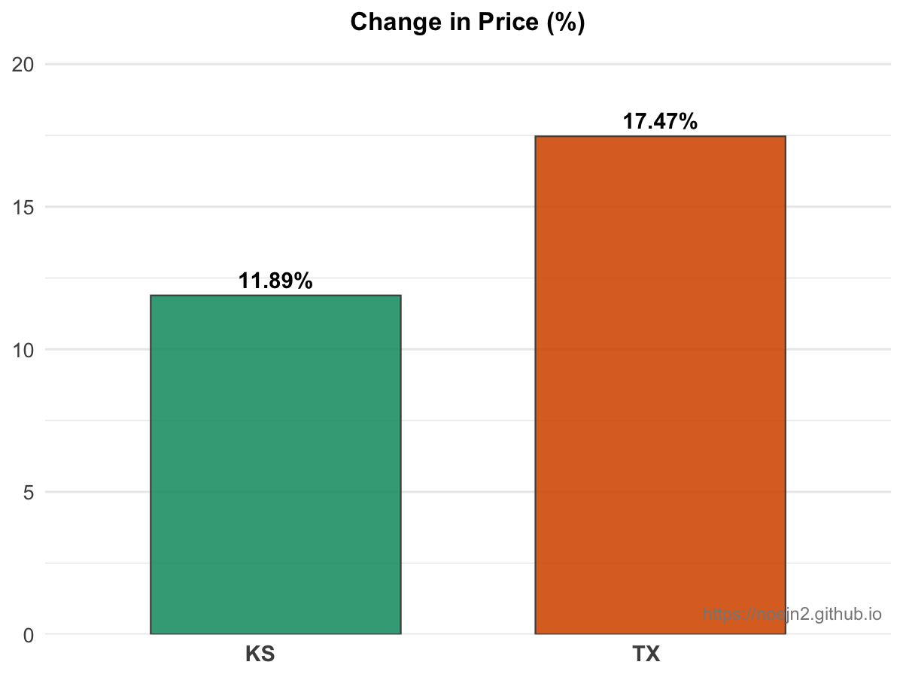

# US Domestic Agricultural Trade Tool: Step-by-Step Tutorial

Welcome! This guide will help you use the US Domestic Agricultural Trade Tool web application to simulate and visualize the effects of shocks to US agricultural production and domestic trade. You will learn how to set up, run, and interpret simulations, with clear examples and annotated screenshots.

---

## Table of Contents

- [US Domestic Agricultural Trade Tool: Step-by-Step Tutorial](#us-domestic-agricultural-trade-tool-step-by-step-tutorial)
  - [Table of Contents](#table-of-contents)
  - [Accessing the Tool](#accessing-the-tool)
  - [Key Features](#key-features)
  - [Understanding the Interface](#understanding-the-interface)
  - [Interpreting Results](#interpreting-results)
  - [Simulation Set-Up](#simulation-set-up)
  - [Running a Simulation: Example Walkthrough](#running-a-simulation-example-walkthrough)
    - [1. Clear the Focus Pool and Simulation](#1-clear-the-focus-pool-and-simulation)
    - [2. Add Texas and Kansas to the Focus Pool](#2-add-texas-and-kansas-to-the-focus-pool)
    - [3. Apply a Productivity Shock to Texas](#3-apply-a-productivity-shock-to-texas)
    - [4. Run the Simulation and Compare Results](#4-run-the-simulation-and-compare-results)
    - [5. Add a Trade Cost Shock from Kansas to Texas](#5-add-a-trade-cost-shock-from-kansas-to-texas)
    - [6. Compare Welfare Effects](#6-compare-welfare-effects)
  - [Considerations, Authorship, and License](#considerations-authorship-and-license)

---

## Accessing the Tool

- Access the web application here:
  [https://noejnava2.shinyapps.io/us_ag_flows_gravityge/](https://noejnava2.shinyapps.io/us_ag_flows_gravityge/)

---

## Key Features

- Download plots and tables in multiple formats for use in reports, research, or presentations (see [LICENSE](LICENSE)).
  - Use **Download** buttons below each figure to save as PNG (note: chord diagram downloads may take a few seconds).
  - Use table export buttons to copy or download data as CSV, Excel, PDF, or print.

---

## Understanding the Interface

**Main Controls:**
- **Select a state:** Add a state to the focus pool for detailed analysis.
- **Delete a state:** Remove a state from the focus pool.
- **Focus pool:** List of states currently selected for focused analysis.
- **Run simulation:** Executes the simulation using the current settings.
- **Clear simulation:** Resets all simulation values and refreshes all figures and tables.
- **State initials:** Toggle between full state names and abbreviations.

---

## Interpreting Results

- **Trade Flow Adjustment:**
  - *Include Others*: Aggregates all states not in the focus pool as "Other".
  - *Include Self-Trade*: Shows production consumed within the same state.
  - *Flow Values*:
    - **Total Exports**: Raw export data.
    - **Net Exports**: Exports minus imports (negative values set to zero).
  - *Baseline* refers to 2017 data; *Simulation* values reflect your scenario.

- **Welfare Effects:**
  - The model simulates three welfare measures (expenditure, prices, wages) relative to the baseline, visualized as:
    - **Welfare Map:** Spatial distribution of welfare changes (click a state for details).
    - **Bar Plot:** Compare welfare measures across selected states.

- **Simulation Parameters:**
  - Simulations are controlled by two sets of parameters (default = 1, so changes are % changes):
    - **Productivity Parameter:** Controls how much more/less productive a state is.
    - **Bilateral Trade Parameter:** Controls how much more/less expensive it is to ship goods from one state to another.

---

## Simulation Set-Up

The simulation helper lets you edit structural parameter matrices easily by selecting the shock type, affected states, and shock level. You can also directly edit the matrices if needed.

*Note:* Productivity shocks are straightforward (e.g., select a producer and set a percentage change). Trade cost shocks are directional: a 10% shock from Origin to Destination increases shipping costs in that direction only. The reverse direction must be set separately if needed.

---

## Running a Simulation: Example Walkthrough

The tool starts with a default simulation: productivity in AZ, CA, CO, NV, NM, and UT is halved to simulate the 2012 Western US drought.

Let's walk through a simpler example: simulating a severe drought in Texas and then mitigating it by reducing shipping costs from Kansas to Texas.

### 1. Clear the Focus Pool and Simulation
First, delete all states from the focus pool and clear the simulation:

### 2. Add Texas and Kansas to the Focus Pool
Add Texas and Kansas. (Tip: Toggle state initials if you are unsure of abbreviations.)

### 3. Apply a Productivity Shock to Texas
In the simulation parameter window, use the simulation helper to set a -99% productivity shock for Texas. Click the **Add Shock** button (thunder icon) to apply. Confirm the shock by checking the productivity matrix for Texas (scroll right if needed).

### 4. Run the Simulation and Compare Results
Click **Run Simulation** to update the results. You can now compare the effects across tables and figures. Below, see how trade between Texas and Kansas changes due to the simulated Texas drought:

**Trade Flows Before and After the Shock:**

| Baseline | Simulation (Texas Drought) |
|:---:|:---:|
|  |  |

### 5. Add a Trade Cost Shock from Kansas to Texas
Now, reduce the trade cost from Kansas to Texas by 20% (simulate improved supply chains). Add this shock using the simulation helper:

### 6. Compare Welfare Effects
Finally, compare the implications for prices (welfare effects window):

| Simulation (Texas Drought) | Simulation (Texas Drought + Reduced Trading Costs) |
|:---:|:---:|
|  |  |

---

## Considerations, Authorship, and License

**Authorship:**

This dashboard and code were developed by Noé J Nava, with contributions from William Ridley and Sandy Dall'Erba. For questions, suggestions, or collaboration, contact:

- Noé J Nava
  [noejnava2@gmail.com](mailto:noejnava2@gmail.com)

**Citation:**

If you use this tool or its results in research, teaching, or policy, please cite:

> Nava, N. J., Ridley, W., & Dall'Erba, S. (2023). "A model of the U.S. food system: What are the determinants of the state vulnerabilities to production shocks and supply chain disruptions?" Agricultural Economics.

**License:**

This project is released under the MIT License. See the [LICENSE](LICENSE) file for details. By using this code or dashboard, you agree to:

- Cite the original paper and acknowledge the authorship of this dashboard in any derivative work, publication, or presentation.
- Comply with the terms and conditions of the MIT License.

